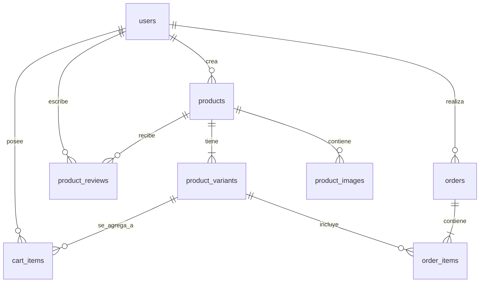

# Guía de Arquitectura de Xhaba - Plataforma de Textiles Oaxaqueños

Esta guía proporciona una descripción detallada de la arquitectura de la aplicación **Xhaba**, diseñada para facilitar el aprendizaje y la comprensión de cómo interactúan todas las partes de la plataforma.

---

## 🛠️ Estructura del Proyecto

El proyecto está dividido en un monorepositorio con dos partes principales:
1. **`client/`**: Aplicación de frontend construida con **React, Vite y Vanilla CSS** para el diseño premium.
2. **`server/`**: API de backend construida con **Express, Node.js y PostgreSQL**.

```
Xhaba/
├── client/                     # Frontend (React)
│   ├── src/
│   │   ├── assets/             # Recursos visuales (ropa_tipica/)
│   │   ├── components/         # Componentes reutilizables e interactivos
│   │   ├── context/            # Proveedores de estado global (Autenticación y Carrito)
│   │   ├── pages/              # Páginas y vistas principales del e-commerce
│   │   ├── router/             # Enrutamiento (React Router DOM)
│   │   ├── services/           # Clientes HTTP (Axios) para comunicación API
│   │   └── utils/              # Helper de carga de imágenes e utilidades
├── server/                     # Backend (Express & PostgreSQL)
│   ├── index.js                # Archivo de entrada del servidor
│   ├── src/
│   │   ├── config/             # Configuraciones (DB, variables de entorno, migraciones)
│   │   ├── controllers/        # Controladores (Lógica de negocio y consultas SQL)
│   │   ├── middlewares/        # Middlewares (Autenticación por token, control de errores)
│   │   ├── routes/             # Enrutamiento de la API REST
│   │   ├── services/           # Servicios auxiliares (Token JWT)
│   │   ├── utils/              # Funciones auxiliares asíncronas
│   │   └── validators/         # Validadores de entrada
```

---

## 💾 Modelo de Base de Datos y Relaciones

El backend utiliza una base de datos relacional **PostgreSQL**. Las principales entidades y sus relaciones son:



### Tablas Principales
1. **`users`**: Almacena clientes, artesanos y administradores. Para los artesanos, guarda detalles de su región de Oaxaca (Valles Centrales, Istmo, Costa, etc.), comunidad, biografía y estado de aprobación.
2. **`products`**: Contiene la información principal de las prendas (nombre, descripción, artesano id, categoría, estado de aprobación).
3. **`product_images`**: Fotos reales asociadas a cada producto. Permite múltiples fotos por producto, marcando una como primaria (`is_primary = true`).
4. **`product_variants`**: Define las tallas (`S`, `M`, `L`, `Única`), stock disponible e inventario de cada prenda.
5. **`cart_items`**: Persistencia en base de datos de los carritos de compra de los usuarios autenticados.
6. **`orders` y `order_items`**: Cabecera y detalle de las compras realizadas.
7. **`product_reviews`**: Reseñas y calificaciones de las prendas por parte de los clientes.

---

## 🔒 Flujo de Autenticación y Autorización

Xhaba implementa un flujo de autenticación seguro y moderno:

1. **Token JWT en Cookies HttpOnly**:
   Al iniciar sesión (`POST /api/auth/login`), el servidor valida las credenciales y firma un token JWT que incluye `{ id, email, role }`. Este token se envía al cliente dentro de una cookie llamada `xhaba_session` con las directivas:
   - `httpOnly`: Impide que scripts de JavaScript accedan al token (protección contra XSS).
   - `secure`: Exige HTTPS para la transmisión de la cookie (en producción).
   - `sameSite: 'lax'`: Protege contra ataques CSRF (Cross-Site Request Forgery).

2. **Control de Sesión Persistente**:
   Cuando el frontend se monta, el `AuthContext` realiza una petición a `/api/auth/me`. Si la cookie está presente y el token es válido, el servidor responde con la información del usuario, poblando el estado global de React de forma transparente sin pedir credenciales de nuevo.

3. **Middlewares de Roles (`authorizeRoles`)**:
   Los endpoints del backend se protegen usando middlewares. Por ejemplo:
   - `authenticateToken`: Verifica la existencia y validez de la cookie de sesión.
   - `authorizeRoles('artisan')` o `authorizeRoles('admin')`: Valida que el rol codificado en el JWT tenga autorización para consumir el endpoint.

---

## 🛒 Sincronización del Carrito (Client-Server Sync)

Para ofrecer una experiencia de usuario fluida, el carrito de compras funciona de la siguiente manera:

1. **Estado de Invitado (Guest)**:
   Si el usuario no ha iniciado sesión, el carrito se guarda localmente en el `localStorage` del navegador.
2. **Sincronización al Iniciar Sesión (Sincronización Masiva)**:
   Al loguearse con éxito, el frontend lee los artículos acumulados en el `localStorage` y envía una petición `POST /api/cart/sync` al backend. El controlador `syncCart` realiza una operación de "upsert" en la tabla `cart_items` para fusionar o agregar los productos locales a la cuenta del usuario en la base de datos.
3. **Persistencia en la Nube**:
   Una vez logueado, cualquier cambio en el carrito (añadir, quitar, modificar cantidad) se guarda directamente en la base de datos (`cart_items`) mediante llamadas AJAX automáticas.

---

## ⚡ Concurrencia de Compras (Stock Locking)

Uno de los desafíos clave en un e-commerce artesanal es evitar la sobreventa de piezas únicas (por ejemplo, un huipil bordado a mano que solo tiene 1 unidad en stock).

```
Cliente A (Petición Checkout)  ──────►  [INICIA TRANSACCIÓN SQL]
                                       SELECT FOR UPDATE (Bloquea variante)
                                       ┌──────────────────────────────┐
Cliente B (Petición Checkout)  ──────► │ Espera a que A termine...    │
                                       │ (Fila bloqueada temporalmente)│
Cliente A Completa la compra   ──────► │ Descuenta stock a 0. COMMIT. │
                                       └──────────────────────────────┘
Cliente B Reanuda la consulta   ──────► Intenta leer stock (ahora es 0)
                                       Lanza Error 409 Conflict. ROLLBACK.
```

### ¿Cómo funciona el bloqueo transaccional?
1. El backend envuelve el checkout en una **Transacción SQL** (`BEGIN / COMMIT`).
2. Para cada artículo del carrito, realiza una consulta con bloqueo de registro:
   ```sql
   SELECT * FROM product_variants WHERE id = $1 FOR UPDATE;
   ```
3. Esta instrucción le dice a PostgreSQL: *"Bloquea esta fila. Si otra petición intenta leer o escribir sobre esta misma variante, ponla en cola de espera hasta que yo haga COMMIT o ROLLBACK"*.
4. El backend verifica si el `stock` actual es suficiente.
   - Si **es suficiente**: Resta la cantidad al stock de la variante e inserta la orden.
   - Si **es insuficiente**: Lanza un error, aborta la transacción (`ROLLBACK`) y retorna un estado HTTP `409 Conflict` (o `400 BadRequest`), liberando la fila.
5. Al hacer `COMMIT`, se liberan los bloqueos y la siguiente transacción en cola procede a validar contra el inventario ya actualizado. Esto previene de forma absoluta la sobreventa física.

---

## 🖼️ Carga Dinámica de Imágenes en Vite

Dado que las fotos del catálogo son archivos estáticos ubicados en `client/src/assets/ropa_tipica`, el cliente utiliza un helper especializado para que Vite empaquete y resuelva las URLs de forma correcta tanto en desarrollo como en producción:

- **La función `getProductImageUrl(imageName)`**:
  Utiliza la API nativa de JavaScript:
  ```javascript
  new URL(`../assets/ropa_tipica/${imageName}`, import.meta.url).href
  ```
  Esto permite a Vite analizar la ruta de forma estática en tiempo de construcción, incluir la imagen en el compilado final del cliente y asignarle su hash correspondiente de producción. Si la imagen no existe o falla, retorna un fallback decorativo.
